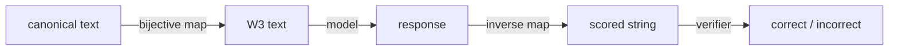
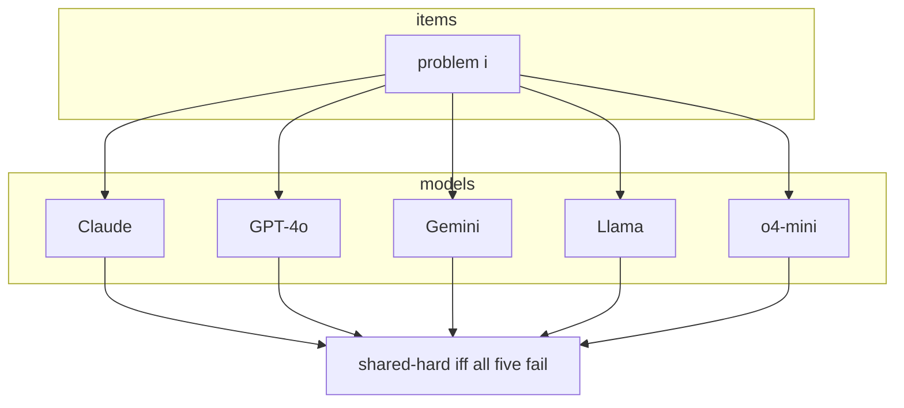
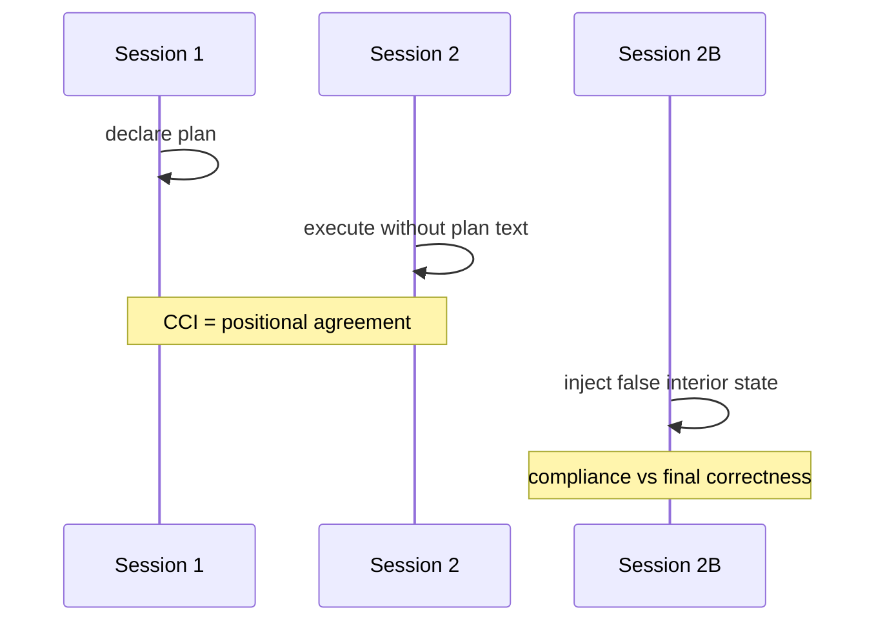
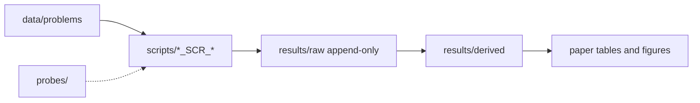

# Surface change as an instrument

A teaching book for the retrieval-vs-computation programme. The chain is a sequence of scientific questions, each answered with a design choice, code from this repository, and a named derived table.

Read [README.md](README.md) first for the programme map. The manuscript is [paper/main.pdf](paper/main.pdf).

---

## How to use this book

Each chapter has the same shape: a hook, the concept from first principles, the design choice (and the alternatives that were not taken), a walkthrough of code that actually runs here, measured evidence with the CSV named, a diagram when control flow matters, and one sentence to keep.

Appendix E lists a reproduce command for every number that appears in the paper.

---

## Chapter 1 — What does a rename actually change?

**Hook.** If two statements differ only in the names of people, objects, or nodes, a procedure that operates on structure should give the same answer. A procedure that is keyed to the original words should not.

**Concept.** A *surface transform* is a map from problem text to problem text that is required to preserve the solution (or to carry a known inverse so the solution can be recovered). Entity rename (W3) is the transform that substitutes a bijective vocabulary while leaving quantities, graph topology, and goal structure fixed. Round-trip: apply the mapping, then the inverse; the original string must return.

**Design choice.** Bind the gold answer to the renamed vocabulary and invert before scoring, rather than scoring the renamed response against the original answer string. Alternative: leave the gold answer in canonical names (then a correct renamed plan is scored wrong). Alternative: paraphrase only (W1), which confounds lexical identity with syntax.

**Code.** Mapping and round-trip live in `scripts/generation/utils/variant_utils.py`. Bank verification is `scripts/generation/stage3_verify_variants.py` (W3 must carry `entity_mapping` / `action_mapping` and survive inverse mapping of the answer for planning and shortest path).

```37:41:scripts/generation/utils/variant_utils.py
def apply_mapping(text: str, mapping: dict) -> str:
    if not mapping:
        return text
    pattern = build_substitution_regex(mapping)
    return pattern.sub(lambda m: mapping[m.group(0)], text)
```

Longer keys are compiled before shorter ones so `unstack` is not corrupted by a mapping for `stack`.



**Evidence.** Gemini GSM: canonical accuracy \(0.909\), W3 \(0.523\) (`results/derived/probe1_per_model_variant.csv`). o4-mini on the same bank is flat on W3 (\(0.841\)). Rename cost is a model property on a fixed item set.

**What to remember.** A rename is a controlled substitution of identifiers, not a new problem; the measurement is whether the procedure is indexed by those identifiers.

---

## Chapter 2 — Does numeric change cost the same?

**Hook.** GSM-Symbolic-style work treats new numbers as the diagnostic for memorisation. If that were the whole story, W6 (new instance of the same template) and W3 (same numbers, new names) would move together.

**Concept.** *Numeric regeneration* (W6) draws a new instantiation: new quantities on an arithmetic template, or a new PDDL / graph instance re-solved by a reference solver. The logical type of the problem is fixed; the particular numbers are not. Cost is *not* a scalar “robustness”: it is a comparison of two treatments on the same items.

**Design choice.** W6 gold is re-derived (GSM-Symbolic instance, Fast Downward plan, DP / shortest-path solver), not copied from canonical. Alternative: resample numbers but keep the original answer (invalid). Alternative: only W6, which cannot detect lexical indexing.

**Code.** `generate_w6` in `scripts/generation/stage2_generate_variants.py` branches by family: GSM loads another template instance; BW samples PDDL and runs Fast Downward; ALGO reseeds graphs and coin sets.

```1306:1323:scripts/generation/stage2_generate_variants.py
        if family == "arithmetic_reasoning":
            m = re.search(r"template_id=(\d+)", row.get("source", ""))
            if not m:
                return None
            inst = _load_gsm_instance(m.group(1), row.get("contamination_pole", "high"))
            ...
            return make_variant_row(
                row,
                "W6",
                inst.get("question", "").strip(),
                answer,
                ...
            )
```

**Evidence.** Same Gemini GSM row: W6 \(0.958\) vs canonical \(0.909\) vs W3 \(0.523\) (`probe1_per_model_variant.csv`). Numeric change is not the expensive axis for this model on this bank.

**What to remember.** If W6 is cheap and W3 is expensive, the load-bearing surface is the name frame, not the numerals.

---

## Chapter 3 — What about representational register?

**Hook.** Entity names can stay fixed while the *genre* of the statement changes: prose to equations, English to PDDL-like operators, story to \(G=(V,E)\).

**Concept.** *Register* is the notational system in which a problem is written. W4 rewrites the same entities and quantities into a formal template. It is not a rename: the identifiers are unchanged. If W4 hurts more than W3, fragility is not “unknown words”; it is a mismatch between the training distribution’s prose and a compact symbolic form.

**Design choice.** Deterministic templates from `difficulty_params` (denominations, edge lists, GSM slots) rather than an LLM rewrite of the formal text. Alternative: ask a model to “make this more formal” (confounds generator quality with the treatment). Alternative: collapse W4 into W2 (layout only), which does not change the mathematical dialect.

**Code.**

```789:816:scripts/generation/stage2_generate_variants.py
def generate_w4(row: dict[str, str], dry_run: bool, logger: logging.Logger) -> dict[str, str] | None:
    ...
            if st == "CC":
                denoms = params.get("denominations", [])
                target = params.get("target", "")
                text = (
                    "FORMAL DEFINITION: π = ⟨D, S₀, S*, A⟩\n"
                    f"DENOMINATIONS: D = {{{', '.join(str(d) for d in denoms)}}}\n"
                    ...
                )
```

**Evidence.** o4-mini GSM: canonical \(0.841\), W3 \(0.841\), W4 \(0.682\) (`probe1_per_model_variant.csv`). Gemini GSM W4 \(0.477\) vs W3 \(0.523\). Formal register is a distinct, often larger, cost.

**What to remember.** Holding names fixed and changing notation isolates register; it is not a milder rename.

---

## Chapter 4 — Does direction matter?

**Hook.** On Blocksworld, exchanging the initial state and the goal is still a legal planning problem. If models were applying a direction-agnostic search, accuracy should be comparable. It is not.

**Concept.** *Direction* is which state is given as origin and which as destination. W5 on BW swaps `:init` and `:goal` in PDDL, then completes a valid init (ontable / clear / handempty) so the instance remains well-formed, and re-solves with an admissible planner for gold.

**Design choice.** Structural swap plus planner gold, not a verbal “solve it backwards” prompt. Alternative: reverse the gold plan string without regenerating the instance (the reversed plan is not in general optimal or even applicable). Alternative: only NL wording of the same PDDL (that is W1/W2).

**Code.**

```295:324:scripts/generation/utils/variant_utils.py
def swap_pddl_init_goal(pddl_text: str) -> str:
    init_start, init_end, init_section = extract_section(pddl_text, "init")
    goal_start, goal_end, goal_section = extract_section(pddl_text, "goal")
    ...
    new_init_section = f"(:init\n{new_init_content})"
    new_goal_section = f"(:goal (and\n{init_content}\n))"
```

**Evidence.** Concordance ranker `BW,anthropic/claude-sonnet-4`: `acc_W5=0.8687`, `acc_W3=0.375` (`C7_concordance_filtered.csv`). Manuscript Table (Blocksworld per-variant): Claude canonical \(.172\) → W5 \(.873\). Direction is not a nuisance factor; it is a treatment that can *raise* accuracy.

**What to remember.** A valid invert of origin and goal tests whether the procedure is forward-search shaped, not whether the instance is “the same puzzle.”

---

## Chapter 5 — Is fragility in the item or the model?

**Hook.** If some problems were intrinsically unsolvable under rename, every model would fail them. Then robustness work would be a catalogue of bad items.

**Concept.** *Locus* is the unit that explains failure: item, model, or item×model. Shared-hard count: number of problems on which *all* primary models fail (canonical, five-model intersection). A count of zero means there is no item that is universally fragile on that bank.

**Design choice.** Restrict the intersection to models that actually have a row (`fail_all_five_paper_models`), rather than treating missing coverage as failure. Alternative: pool all variants into one “hard item” flag (confounds W3 with W4). Alternative: only models that score above a floor (selection on the dependent variable).

**Code.** `scripts/consolidate/p1_failure_patterns.py` writes `P1_failure_patterns.csv` from included rescored P1 rows.



**Evidence.** `P1_failure_patterns.csv`: ALGO \(0/110\), GSM \(0/20\) (five-model intersection), BW \(14/64\) (all fourteen in mystery/obfuscated planning). \(\phi\) between canonical and W3 correctness varies by model (`can_vs_w3` rows in the same file): o4-mini GSM \(\phi=0.660\), Gemini GSM \(\phi=0.014\).

**What to remember.** Outside obfuscated planning, rename failure is an interaction, not a property of the problem text alone.

---

## Chapter 6 — Is robustness one capacity or several?

**Hook.** Papers often report a single “robustness drop.” If models agree on which *transform* is hard, that ordering is a family-level fact. If they disagree across families, “model \(X\) is rename-fragile” is not well-formed without a family index.

**Concept.** Kendall’s \(W\) measures concordance of rankings. Here the ranking is W1–W6 ordered by accuracy, once within a family across models, once within a model across families. The null permutes ranks *within* each ranker (`scripts/consolidate/p1_variant_ordering.py`, \(N=10^4\), seed 42).

**Design choice.** Rank *transforms*, not items. Item-level shared-hard (Chapter 5) answers a different question; the two can coexist: models agree which *kind* of surface is hard and still fail different *items*. Alternative: Spearman of raw accuracy vectors (sensitive to ties and floors). Alternative: a single PCA on all variants (collapses family structure).

**Code.** Output: `results/derived/P1_variant_ordering.csv`. Degeneracy filter (flat or floor rankers) is audited in `C7_concordance_filtered.csv`.

**Evidence.** Within family: ALGO \(W=0.4194\) \(p=0.0491\), BW \(W=0.6786\) \(p=0.0001\), GSM \(W=0.6603\) \(p=0.0419\). Within Claude across families: \(W=0.1651\) \(p=0.8239\). Rename survival also covaries with plan–execution consistency when pooled (\(r=0.243\), \(p=0.024\), \(n=272\); paper Table `tab:convergence`), while rank correlation with canonical accuracy is consistent with zero.

**What to remember.** Transform difficulty tracks the task family; accuracy and invariance are separable enough to measure as different capacities.

---

## Chapter 7 — Does the trace reflect the computation?

**Hook.** If the chain of intermediate values were the computation, inserting a false intermediate would either be refused or would derail the answer.

**Concept.** *Plan–execution consistency* (CCI): a plan is elicited in one session; execution is a second session; agreement is positional match (GSM: numeric \(\varepsilon=0.01\); BW: action strings). *Injection* (Phase 2B): at an interior step, replace the true state with a plausible false one. *Compliance* is whether that false state is treated as given. *Correctness* is whether the final answer is still gold.

**Design choice.** Hard session isolation for CCI (no transcript of the plan in the execution prompt). Alternative: one long chain-of-thought (then “plan” and “execution” are the same string). Alternative: score only final answers after injection (then compliance is invisible).

**Code.** CCI aggregation: `probes/behavioral/cci.py`. TEP after corruption: `probes/behavioral/tep.py`. GSM summary: `scripts/GSM_P2_SCR_compute_metrics.py` → `results/derived/GSM_P2_metrics.csv`. ALGO injection logs: `results/raw/ALGO_P2_phase2_injected.csv`.

```12:44:probes/behavioral/cci.py
def compute_cci(
    problem_id: str,
    generated_plan: list[str],
    executed_steps: list[str],
) -> dict:
    ...
    total_steps_compared = min(len(gen_norm), len(exec_norm))
    matched_steps = 0
    for i in range(total_steps_compared):
        if gen_norm[i] == exec_norm[i]:
            matched_steps += 1
    cci = round(matched_steps / total_steps_compared, 4)
```



**Evidence.** GSM mean CCI: Gemini \(0.270\), Claude \(0.231\), GPT-4o \(0.108\) (`GSM_P2_metrics.csv`, `mean_cci_excluding_valid_divergence`). ALGO Phase 2B: o4-mini compliance \(1.0\) (\(n=61\)); pooled `post_injection_correct` \(0.390\) on `ALGO_P2_phase2_injected.csv` (`scientific_file_profiles.csv`). Paper: Claude \(88.5\%\) accept, post-injection accuracy \(.525\) vs uninjected \(.541\).

**What to remember.** A model can adopt a false premise in the visible trace and still finish at near-baseline accuracy; the trace is not a sufficient statistic of the computation.

---

## Appendix A — Variant definitions

| Code | Treatment | Gold |
|------|-----------|------|
| canonical | released wording | bank `correct_answer` |
| W1 | lexical paraphrase | same as canonical |
| W2 | structural reformat | same as canonical |
| W3 | entity / action rename | inverse-mapped or structure-preserving answer |
| W4 | formal notation, names held | same as canonical |
| W5 | direction reversal (BW init/goal; family-specific elsewhere) | re-solved |
| W6 | new numbers / new instance | re-solved |

---

## Appendix B — Probes

| Probe | Question | Primary artefacts |
|-------|----------|-------------------|
| P1 | Does the verified answer survive W1–W6? | `results/raw/{FAM}_P1_behavioral*.csv` |
| P2A | Does execution match the declared plan? | CCI columns; `GSM_P2_cci.csv`, ALGO phase files |
| P2B | Does a false interior state change the answer? | `ALGO_P2_phase2_injected.csv` |
| P3 | Does public-corpus \(n\)-gram proximity track behaviour? | `*_P3_contamination.csv`, triangulation CSVs |

---

## Appendix C — Banks and models

- `data/problems/question_bank_gsm.csv` — arithmetic (\(n=44\) canonical IDs in bank).
- `data/problems/question_bank_bw.csv` — Blocksworld / mystery.
- `data/problems/question_bank_algo.csv` — CC, SP, WIS (\(n=110\)).
- Models: Claude Sonnet 4, GPT-4o, Gemini 2.5 Flash, Llama-3.1-8B-Instruct, o4-mini (plus BW concordance ranker DeepSeek-R1-distill where present).

---

## Appendix D — Data flow



Raw is never overwritten in place; sweeps `--resume` on `(problem_id, variant_type, model)`. Derived is regenerated by `python scripts/runs/rederive_all_metrics.py`.

---

## Appendix E — Reproduce every number in the paper

Run from the repo root with `PYTHONPATH=.`. Aggregates do not need API keys.

**Master recompute**

```bash
python scripts/runs/rederive_all_metrics.py
python scripts/consolidate/p1_variant_ordering.py
python scripts/consolidate/p1_failure_patterns.py
python scripts/GSM_P2_SCR_compute_metrics.py
```

| Paper claim | Source file | How to obtain |
|-------------|-------------|----------------|
| GSM Gemini Acc\(_\mathrm{can}\)=.909, Acc\(_{W3}\)=.523, \(\Delta\)=.386 | `results/derived/probe1_per_model_variant.csv`; `paper/tables/table3_gsm_p1.tex` | `GSM,Gemini,canonical` / `W3` |
| GSM Gemini W6=.958 | same CSV | `GSM,Gemini,W6` \(n=24\) |
| GSM o4-mini can=.841, W4=.682, W3=.841 | same | `GSM,o4-mini` |
| GSM Claude can=.841, W3=.750 | same | `GSM,Claude` |
| GSM GPT-4o can=.850, W3=.300 (\(n=20\)) | same | `GSM,GPT-4o` `n_valid=20` |
| GSM Llama can=.800, W3=.150 (\(n=20\)) | same | `GSM,Llama` |
| GSM P2 CCI Gemini .270, Claude .231, o4-mini .220, Llama .167, GPT-4o .108 | `results/derived/GSM_P2_metrics.csv` | `mean_cci_excluding_valid_divergence` |
| GSM P2 TEP Claude .539 … Llama .773 | same | `mean_tep` |
| BW Claude can=.172, W5=.873 | `paper/main.tex` Table `tab:bw`; ranker W5 `C7_concordance_filtered.csv` `acc_W5=0.8687` | concordance ranker vs manuscript table |
| BW Gemini can=.391, W5=.764 | `C7_concordance_filtered.csv` `acc_W5=0.7636` | ranker `BW,google/gemini-2.5-flash` |
| BW o4-mini W5=.909, W6=1.000 | same | `acc_W5=0.9091`, `acc_W6=1.0` |
| Shared-hard 0/110, 0/20, 14/64 | `results/derived/P1_failure_patterns.csv` | `fail_all_five_paper_models` |
| Kendall \(W\) ALGO .419 \(p=.049\), BW .679 \(p<.001\), GSM .660 \(p=.042\) | `results/derived/P1_variant_ordering.csv` | `within_family_across_models` |
| Claude \(W=.165\) \(p=.824\); Gemini \(W=.238\) \(p=.673\) | same | `within_model_across_families` |
| \(\phi\) ALGO Claude .68, GPT-4o .52, Gemini .33 | `P1_failure_patterns.csv` `can_vs_w3` | `stat` column |
| \(\phi\) GSM o4-mini .66, Gemini .01, GPT-4o −.03 | same | `can_vs_w3` GSM rows |
| CCI vs rename \(r=.243\) \(p=.024\) \(n=272\) | paper Table `tab:convergence` | cluster bootstrap 5000, seed 42 (script path in `scripts/runs/` convergence helpers) |
| Injection Claude 88.5%, GPT-4o 93.4%, o4-mini 100%, Llama 39.3%, Gemini 0% | `rebuild/NUMBERS.csv` keys `P2.3.ALGO.*.compliance.compliant` | \(n=61\) |
| Post-injection Claude .525 vs .541; GPT-4o .508 vs .557; o4-mini .377 vs .409 | paper §Compliance; pooled log rate `scientific_file_profiles.csv` `.390` | `post_injection_correct` |
| Proximity CC \(\bar c_T=0.468\), SP \(0.147\), WIS \(0.000\) | `paper/tables/table5_proximity.tex` | Infini-gram template scores |
| ALGO clone collapse 110→51 families | paper abstract / methods | bank clone audit `results/derived/bank_clone_audit.csv` |
| Verifier ablation planning cell \(0.252\to0.043\) | paper abstract | oracle audit CSVs under `results/derived/C5_*` |
| BW unmatched Claude \(0.170\to0.638\) W6 | paper abstract | unmatched regeneration contrast in main text |
| Pooled G / variance facets .327 model vs .018 item (ALGO); GSM items .186 model .009 | paper §Fragility | `results/derived/O10_variance_components.csv` |
| Arithmetic 20 reliable crossovers vs null 0.57 | paper §Fragility | crossover scripts / derived companions |
| Intrusion o4-mini ALGO .619 (13/21) | paper §Compliance | intrusion tables under `rebuild/solidify/` and derived T2 files |
| Coverage ~20{,}000 API calls | `paper/tables/table2_coverage.tex` | caption |

**PDF build**

```bash
cd paper && pdflatex main && bibtex main && pdflatex main && pdflatex main
```
