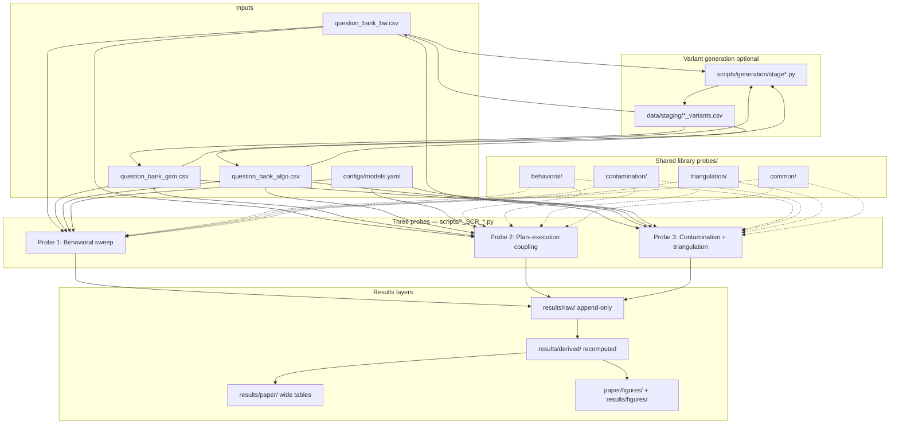

# Retrieval vs Computation — LLM Reasoning Evaluation

This repository implements a **three-probe evaluation framework** across **Blocksworld (BW)**, **GSM arithmetic**, and **Algorithmic (ALGO)** problem families. The core question: when two models score the same, are they solving problems the same way — by **retrieval** (pattern recall) or **computation** (structure-sensitive reasoning)?

**Published work:** *Same Score, Different Strategy* (CAISc 2026) — LaTeX package in [`paper/`](paper/).  
**Future research roadmap:** [`research-vault/RVC_MASTER_DOCUMENT.md`](research-vault/RVC_MASTER_DOCUMENT.md) + linked notes in [`research-vault/RvC_Research_Vault.zip`](research-vault/RvC_Research_Vault.zip).

---

## Where everything lives

| If you want to… | Open this |
|-----------------|-----------|
| **Accepted paper** (build PDF, tables, figures) | [`paper/main.tex`](paper/main.tex) · [`paper/README.md`](paper/README.md) |
| **Future research program** (phases, claims, evaluation catalog) | [`research-vault/RVC_MASTER_DOCUMENT.md`](research-vault/RVC_MASTER_DOCUMENT.md) |
| **Full research vault** (110+ linked planning notes) | Extract [`research-vault/RvC_Research_Vault.zip`](research-vault/RvC_Research_Vault.zip) |
| Consolidated analysis (every number from every probe) | [`ANALYSIS.md`](ANALYSIS.md) |
| Script → artifact map | [`results/README.md`](results/README.md) |
| Probe×family runbooks | [`docs/evaluation/MASTER_EVALUATION_PIPELINES.md`](docs/evaluation/MASTER_EVALUATION_PIPELINES.md) |
| GPU / API ops notes | [`docs/workbench/`](docs/workbench/) |
| Model roster and API IDs | [`configs/models.yaml`](configs/models.yaml) |

**Data flow:** `data/problems/` → `scripts/*_SCR_*.py` → `results/raw/` → `results/derived/` → `results/paper/` (CSV tables) + `paper/figures/` (manuscript PDFs).

---

## Fresh checkout? Start here.

```bash
git clone <this-repo-url>
cd retrieval-vs-computation
make bootstrap            # pip install + clone PlanBench, GSM-Symbolic, Fast Downward
cp .env.example .env      # then fill in OPENROUTER_API_KEY etc.
```

`make bootstrap` clones three external repos that are intentionally **not committed** (they live under `data/sources/` and `tools/`, gitignored):

| Path | Source | Why we need it |
|---|---|---|
| `data/sources/planbench/` | [`karthikv792/LLMs-Planning`](https://github.com/karthikv792/LLMs-Planning) | PlanBench PDDL problems for BW |
| `data/sources/gsm_symbolic/` | [`apple/ml-gsm-symbolic`](https://github.com/apple/ml-gsm-symbolic) | GSM-Symbolic templates for GSM variants |
| `tools/fast-downward/` | [`aibasel/downward`](https://github.com/aibasel/downward) | Reference PDDL planner for BW plan validation |

If you only want to reproduce numbers from already-committed CSVs, skip the bootstrap and run `pip install -r requirements.txt` + `make test`.

---

## Start here (returning user)

| If you want to… | Open this |
|-----------------|-----------|
| Read the consolidated analysis (every number from every probe) | [`ANALYSIS.md`](ANALYSIS.md) |
| See every script → file mapping | [`results/README.md`](results/README.md) |
| Full probe×family runbooks | [`docs/evaluation/MASTER_EVALUATION_PIPELINES.md`](docs/evaluation/MASTER_EVALUATION_PIPELINES.md) |
| Tagged index of all result files | [`results/ARTIFACT_REGISTRY.csv`](results/ARTIFACT_REGISTRY.csv) |
| Canonical path constants in code | [`probes/common/results_paths.py`](probes/common/results_paths.py) |
| Model roster and API IDs | [`configs/models.yaml`](configs/models.yaml) |
| Accepted CAISc paper | [`paper/main.tex`](paper/main.tex) |
| Future research roadmap | [`research-vault/RVC_MASTER_DOCUMENT.md`](research-vault/RVC_MASTER_DOCUMENT.md) |

**Canonical outputs:** model runs in `results/raw/`; metrics in `results/derived/`; manuscript CSV tables in `results/paper/`; paper PDF figures in `paper/figures/`; probe diagnostic plots in `results/figures/`.

## Architecture



**Design principle:** only `results/raw/` is append-only (sweeps support `--resume` on `(problem_id, variant_type, model)`). Everything in `derived/`, `paper/`, and `figures/` is **reproducible** from raw + banks — rerun metric and consolidation scripts after changing raw data or metric definitions.

---

## The three probes

| Probe | Question | Primary signals |
|-------|----------|-----------------|
| **P1 — Behavioral invariance** | Does the verified **answer** stay correct under controlled variants W1–W6? | VAR, CSS, VRI, PDAS (BW), GSS (ALGO) |
| **P2 — Plan–execution coupling** | Does declared **strategy** match stepwise behavior and react to injection? | CCI, TEP, ADC, CPP, FDI (family-specific) |
| **P3 — Contamination + triangulation** | Is behavior correlated with **corpus proximity** (InfiniGram), and do all probes **converge per instance**? | contamination score, template/instance decompose, `convergence_label` / `diagnosis` |

**Variant types (shared):** `canonical`, `W1` (lexical), `W2` (structure), `W3` (entity rename), `W4` (formal notation), `W5` (reversal — excluded from CSS), `W6` (procedural regeneration). See [`docs/evaluation/MASTER_EVALUATION_PIPELINES.md`](docs/evaluation/MASTER_EVALUATION_PIPELINES.md) §1.3.

**Families:**

| Code | Bank file | Subtypes | Role in paper |
|------|-----------|----------|---------------|
| **BW** | `data/problems/question_bank_bw.csv` | blocksworld, mystery | Planning calibration; Probe 3 shows floor/clustering — use as diagnostic, not co-equal with GSM for contamination claims |
| **GSM** | `data/problems/question_bank_gsm.csv` | gsm | Primary arithmetic robustness + contamination evidence |
| **ALGO** | `data/problems/question_bank_algo.csv` | coin_change, shortest_path, wis | Algorithmic structure; greedy-vs-optimal and adversarial instances |

---

## Repository layout

```
rvc/
├── research-vault/              # Future research program (master doc + vault zip)
├── paper/                       # CAISc 2026 accepted paper (LaTeX, tables, figures)
│   └── figures/scripts/         # Figure generators (main + probe + legacy)
├── configs/models.yaml          # OpenRouter model IDs
├── data/problems/               # Question banks (BW, GSM, ALGO)
├── probes/                        # Reusable evaluation library
├── scripts/                       # Runnable sweeps (*_SCR_*.py) and family figures (*_FIG_*.py)
├── results/
│   ├── raw/                     # Model outputs (append-only)
│   ├── derived/                 # Recomputed metrics
│   ├── paper/                   # Manuscript CSV tables + AUDIT/
│   └── figures/                 # Probe diagnostic plots (non-manuscript)
├── docs/
│   ├── evaluation/              # Probe×family replication guides
│   └── workbench/               # GPU runbook, checklists, pipeline reference
├── ANALYSIS.md                  # Consolidated empirical analysis
└── tests/
```

**Script naming:** `{FAM}_P{probe}_SCR_{action}.py` runs evaluation; `{FAM}_P{probe}_FIG_generate.py` or `paper/figures/scripts/` produces plots.

---

## Evaluation pipeline (end-to-end)

### Layer 0 — Question banks

Banks share a unified schema (`probes/common/io.py`): `problem_id`, `variant_type`, `problem_text`, `correct_answer`, `problem_family`, `problem_subtype`, `difficulty`, `contamination_pole`, `difficulty_params`, etc.

Variant rows are generated via `scripts/generation/` (stage scripts) into `data/staging/`, then merged into the family banks. Bank fix/consolidation: `scripts/consolidate/fix_banks.py`, `fix_gsm_bank.py`.

### Layer 1 — Raw runs (`results/raw/`)

All sweeps take `--resume`: skip rows already present; retry rows whose `raw_response` starts with `ERROR:`.

**Environment:** `OPENROUTER_API_KEY` required; optional `ANTHROPIC_API_KEY` for GSM Probe 2 native Anthropic client. Verify with `python scripts/test_api_keys.py`. Models (behavioral roster): `anthropic/claude-sonnet-4`, `openai/gpt-4o`, `meta-llama/llama-3.1-8b-instruct`.

#### Probe 1 — Behavioral

| Family | Script | Output |
|--------|--------|--------|
| ALGO | `ALGO_P1_SCR_run_behavioral_sweep.py` | `ALGO_P1_behavioral_{claude,gpt4o,llama}.csv` |
| GSM | `BW_P1_SCR_run_behavioral_sweep.py --family arithmetic_reasoning` | `GSM_P1_behavioral_{claude,gpt4o,llama}.csv` |
| BW | `BW_P1_SCR_run_behavioral_sweep.py` | `BW_P1_behavioral.csv` (all models) |

#### Probe 2 — Plan–execution

| Family | Script | Output |
|--------|--------|--------|
| ALGO | `ALGO_P2_SCR_run_phase1.py` → `ALGO_P2_SCR_run_phase2.py` | `ALGO_P2_phase1_{claude,gpt4o,llama}.csv`, `ALGO_P2_phase2_{normal,injected}.csv` |
| GSM | `GSM_P2_SCR_run_probe2.py` | `GSM_P2_cci.csv` |
| BW | `BW_P2_SCR_extract_phase1_plans.py` → `BW_P2_SCR_run_cci.py` / `run_tep.py` | `BW_P2_plans.csv`, `BW_P2_cci.csv`, `BW_P2_tep.csv` |

#### Probe 3 — Contamination

| Family | Script | Output |
|--------|--------|--------|
| All | `BW_P3_SCR_run_contamination_triage.py` (family flag) or family-specific triage scripts | `{FAM}_P3_contamination.csv` |
| Optional | `run_mechanistic_sweep.py` | `{FAM}_P3_mechanistic.csv` (GPU / TransformerLens) |

InfiniGram queries are cached in `data/infinigram_cache.json`. Blocksworld supports template/instance decomposition via `--decompose-contamination` on the triage script.

### Layer 2 — Derived metrics (`results/derived/`)

| Script | Output |
|--------|--------|
| `ALGO_P1_SCR_compute_metrics.py` | `ALGO_P1_metrics.csv` |
| `GSM_P1_SCR_compute_metrics.py` | `GSM_P1_metrics.csv` |
| `BW_P1_SCR_compute_metrics.py` | `BW_P1_metrics.csv` |
| `ALGO_P2_SCR_compute_metrics.py` | `ALGO_P2_metrics.csv`, `ALGO_P2_per_instance_cci.csv` |
| `GSM_P2_SCR_compute_metrics.py` | `GSM_P2_metrics.csv` |
| `ALGO_P3_SCR_triangulation.py` | `ALGO_P3_triangulation.csv` |
| `BW_P3_SCR_run_triangulation.py` | `BW_P3_triangulation_{claude,gpt4o,llama}.csv` |

Triangulation merges P1 behavioral + P2 CCI/TEP (or ALGO phase outputs) + P3 contamination into one row per `(problem_id, model)` with convergence labels.

### Layer 3 — Paper & figures

| Script | Output |
|--------|--------|
| `consolidate/make_table1.py` | `paper/TABLE1_cross_family.csv` |
| `consolidate/run_css_regressions.py` | `paper/cross_family_regression.csv` |
| `*_FIG_generate.py`, `paper/figures/scripts/*.py` | `paper/figures/` or `results/figures/` |

**One-shot local rebuild** (metrics → tables; no API):

```bash
PYTHONPATH=. python scripts/consolidate/run_paper_consolidation.py
```

Prefer the granular cheat sheet in [`results/README.md`](results/README.md) when you only need to refresh one layer.

---

## Canonical files to open first

### Blocksworld

| Layer | Path |
|-------|------|
| Bank | `data/problems/question_bank_bw.csv` |
| P1 raw | `results/raw/BW_P1_behavioral.csv` |
| P2 raw | `results/raw/BW_P2_{plans,cci,tep}.csv` |
| P3 raw | `results/raw/BW_P3_contamination.csv` |
| P1 metrics | `results/derived/BW_P1_metrics.csv` |
| Triangulation | `results/derived/BW_P3_triangulation_{claude,gpt4o,llama}.csv` |

### GSM

| Layer | Path |
|-------|------|
| Bank | `data/problems/question_bank_gsm.csv` |
| P1 raw | `results/raw/GSM_P1_behavioral_{claude,gpt4o,llama}.csv` |
| P2 raw | `results/raw/GSM_P2_cci.csv` |
| P3 raw | `results/raw/GSM_P3_contamination.csv` |
| P1/P2 metrics | `results/derived/GSM_P1_metrics.csv`, `GSM_P2_metrics.csv` |
| Triangulation | `results/derived/GSM_P3_triangulation_per_instance_*.csv` |

### ALGO

| Layer | Path |
|-------|------|
| Bank | `data/problems/question_bank_algo.csv` |
| P1 raw | `results/raw/ALGO_P1_behavioral_{claude,gpt4o,llama}.csv` |
| P2 raw | `results/raw/ALGO_P2_phase1_*_new.csv`, `ALGO_P2_phase2_{normal,injected}.csv` |
| P3 raw | `results/raw/ALGO_P3_contamination.csv` |
| P1/P2 metrics | `results/derived/ALGO_P1_metrics.csv`, `ALGO_P2_metrics.csv` |
| Triangulation | `results/derived/ALGO_P3_triangulation.csv` |

### Cross-family paper tables

- `results/paper/TABLE1_cross_family.csv` — main comparison table  
- `results/paper/cross_family_regression.csv` — contamination–stability regressions  
- `results/paper/PROBE2_consolidated.csv` — Probe 2 summary across families  

---

## Makefile shortcuts

```bash
make setup          # pip install -r requirements.txt
make test           # pytest tests/
make sweep          # BW Probe 1 behavioral sweep
make triage         # BW Probe 3 contamination triage
make triangulate    # BW Probe 3 triangulation
make mechanistic    # mechanistic sweep (optional, GPU)
```

All commands assume `PYTHONPATH=.` (the Makefile sets this for targets above).

---

## Known data caveats (read before citing numbers)

These are **empirical state**, not code bugs — document them in any analysis write-up.

| Area | Caveat |
|------|--------|
| **BW P2 CCI / TEP** | Large fraction of null CCI/TEP rows — sparse plan–execution signal |
| **BW triangulation** | ~20% `execution_unavailable` (missing PDDL / `BW_E*` instances) |
| **BW P3 contamination** | Template scores often floor at 0; instance scores vary — weak primary family for contamination claims |
| **GSM P1** | Partial variant coverage on some instances; check sweep completeness before VAR/CSS |
| **ALGO P2 injected** | Partial run coverage; adversarial CCI (`ACI`) only where per-instance CCI exists |
| **InfiniGram** | Scores depend on cache + query formulation; use `data/infinigram_cache.json` for reproducibility |

---

## Development

```bash
python -m venv .venv && source .venv/bin/activate
pip install -r requirements.txt
export OPENROUTER_API_KEY=...
PYTHONPATH=. pytest tests/ -v
```

**Lint/format:** `make lint` / `make format` (black + ruff on `probes/`, `scripts/`, `tests/`).

**Dry runs:** most sweep scripts accept `--dry-run` (uses `MockClient`) for plumbing tests without API spend.

---

## Documentation index

| Document | Contents |
|----------|----------|
| [`ANALYSIS.md`](ANALYSIS.md) | **Consolidated analysis — every number from every probe + hidden findings + pointer index** |
| [`docs/evaluation/MASTER_EVALUATION_PIPELINES.md`](docs/evaluation/MASTER_EVALUATION_PIPELINES.md) | Full probe×family replication guide |
| [`docs/evaluation/BW_EVALUATION_FLOW.md`](docs/evaluation/BW_EVALUATION_FLOW.md) | Blocksworld-specific flow |
| [`docs/evaluation/GSM_EVALUATION_FLOW.md`](docs/evaluation/GSM_EVALUATION_FLOW.md) | GSM-specific flow |
| [`docs/evaluation/ALGO_EVALUATION_FLOW.md`](docs/evaluation/ALGO_EVALUATION_FLOW.md) | ALGO-specific flow |
| [`results/README.md`](results/README.md) | Script → artifact matrix, metric column glossary, regenerate cheat sheet |

---

## External build-time dependencies (gitignored, reclone via `make bootstrap`)

These three upstream repos were used to construct the frozen question banks under `data/problems/`. They are **not committed** because of size; `make bootstrap` clones them into the expected paths.

| Path | Source | Role in pipeline |
|---|---|---|
| `data/sources/planbench/` | [`karthikv792/LLMs-Planning`](https://github.com/karthikv792/LLMs-Planning) | PlanBench PDDL instances for BW (`scripts/generation/stage1_extract_bw.py`) |
| `data/sources/gsm_symbolic/` | [`apple/ml-gsm-symbolic`](https://github.com/apple/ml-gsm-symbolic) | GSM-Symbolic templates for arithmetic instances (`scripts/generation/stage1_extract_gsm.py`) |
| `tools/fast-downward/` | [`aibasel/downward`](https://github.com/aibasel/downward) | Reference PDDL planner for BW canonical/W5/W6 plan validation |

You only need these if you want to **regenerate** banks (`scripts/generation/stage{1..5}*.py`). Reproducing Probe 1–3 numbers from the existing banks works without them.
