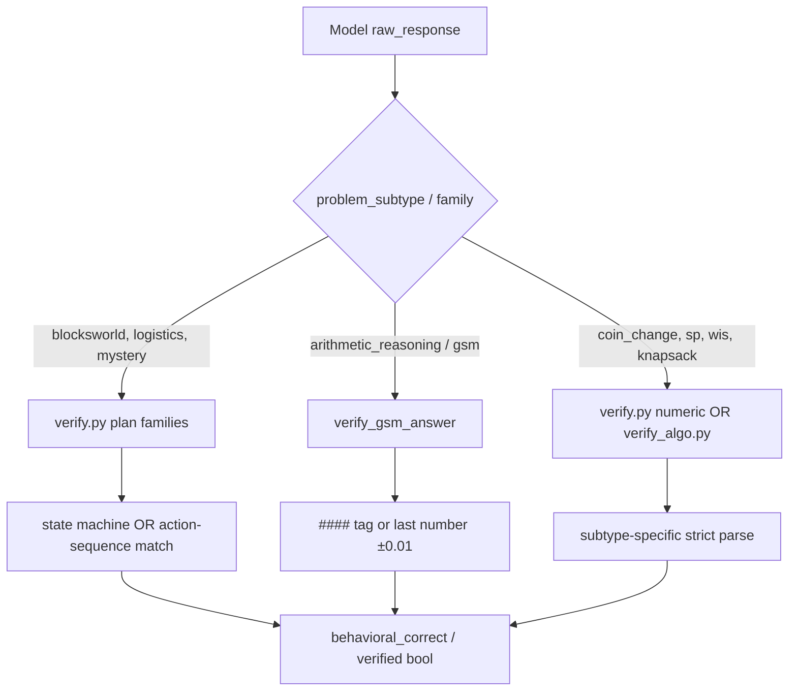
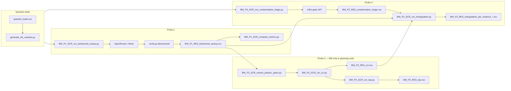
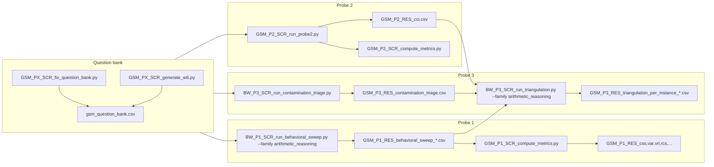
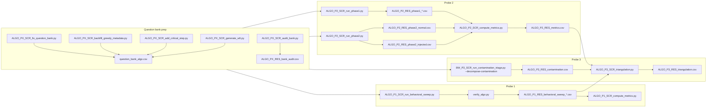

# Master Evaluation Pipelines (Probe 1–3 × BW, GSM, ALGO)

This document is the end-to-end map for every evaluation pipeline in this repository: **question bank → W6 generation → verifier → model call → results → figures → triangulation**. It is written for defense, replication, and paper writing.

Family-specific quick references still live in:

- [BW_EVALUATION_FLOW.md](./BW_EVALUATION_FLOW.md)
- [GSM_EVALUATION_FLOW.md](./GSM_EVALUATION_FLOW.md)
- [ALGO_EVALUATION_FLOW.md](./ALGO_EVALUATION_FLOW.md)

---

## Table of contents

1. [Shared concepts](#1-shared-concepts)
2. [Blocksworld (BW)](#2-blocksworld-bw)
3. [GSM (arithmetic)](#3-gsm-arithmetic)
4. [Algorithmic (ALGO)](#4-algorithmic-algo)
5. [Cross-family comparison](#5-cross-family-comparison)
6. [Figure generation index](#6-figure-generation-index)
7. [Environment and one-shot consolidation](#7-environment-and-one-shot-consolidation)

---

## 1. Shared concepts

### 1.1 What the three probes measure

| Probe | Name | Question |
|-------|------|----------|
| **Probe 1** | Behavioral invariance | Does the model’s **answer** stay correct under controlled surface/structure perturbations (`W1`–`W6`)? |
| **Probe 2** | Plan–execution coupling | Does the model’s **declared strategy** match its **stepwise behavior**, and does it adapt after corruption? |
| **Probe 3** | Contamination + triangulation | Is behavior correlated with **training-corpus proximity** (Infini-gram), and do all probes **agree per instance**? |

### 1.2 Unified question-bank schema

All banks use the same column contract (see `probes/common/io.py`):

| Column | Role |
|--------|------|
| `problem_id` | Stable id, e.g. `BW_001`, `GSM_010`, `CC_003` |
| `variant_type` | `canonical` or `W1`…`W6` |
| `problem_text` | Prompt sent to the model |
| `correct_answer` | Ground truth (plan string, number, path, coin list, …) |
| `problem_family` | Umbrella label, e.g. `planning_suite`, `arithmetic_reasoning`, `algorithmic` |
| `problem_subtype` | Verifier routing, e.g. `blocksworld`, `gsm`, `coin_change` |
| `difficulty` | Tier label |
| `contamination_pole` | `high` / `low` design axis for Probe 3 regressions |
| `source` | Provenance (PlanBench path, GSM template id, generator seed, …) |
| `verifier_function` | Optional explicit verifier hint |
| `difficulty_params` | JSON blob (critical for ALGO; optional elsewhere) |
| `notes` | Human notes |

### 1.3 Variant types (W1–W6)

| Code | Name | Answer changes? | In CSS pool? | Families |
|------|------|-----------------|--------------|----------|
| `canonical` | Base instance | — | No (reference) | All |
| `W1` | Lexical paraphrase | No | Yes | All |
| `W2` | Structural reformat | No | Yes | All |
| `W3` | Entity rename | No | Yes | All |
| `W4` | Formal notation | No | Yes | BW (planning), ALGO |
| `W5` | Reversal | **Yes** | **No** — use RCS | BW, SP, CC |
| `W6` | Procedural regeneration | New instance, same structure | Yes | All |

**CSS** (`probes/behavioral/css.py`) = fraction of `W1,W2,W3,W4,W6` variants whose verified answer matches canonical. **W5 is never pooled into CSS**; use **RCS** (`probes/behavioral/rcs.py`).

### 1.4 Model clients (all families)

| Client | Module | When used |
|--------|--------|-----------|
| `OpenRouterClient` | `probes/behavioral/openai_client.py` | Default for GPT-4o, Claude via OpenRouter, Llama instruct |
| `AnthropicClient` | `probes/behavioral/anthropic_client.py` | GSM Probe 2 when model id starts with `anthropic/` and `ANTHROPIC_API_KEY` is set |
| `ModelClient` | `probes/behavioral/model_client.py` | BW Probe 2 CCI/TEP multi-turn sessions |
| `MockClient` | `probes/behavioral/mock_client.py` | `--dry-run` / local plumbing tests |

**API contract:** every client implements `complete(problem_id, prompt) -> {"response": str, ...}`. Failures are stored as `raw_response` starting with `ERROR:`; resume logic retries those rows.

**Environment:** `OPENROUTER_API_KEY` (and optionally `ANTHROPIC_API_KEY`). Check with `scripts/test_api_keys.py`.

### 1.5 Verifier routing (high level)



**BW / planning:** `probes/contamination/verify.py` — `verify_answer()` simulates blocksworld/mystery actions against parsed initial/goal state, then falls back to normalized action-sequence equality with ground truth.

**GSM:** same module, `verify_gsm_answer()` — prefers `#### <num>` GSM format, else last numeric token.

**ALGO:** dedicated `probes/contamination/verify_algo.py` — `verify_algo()` dispatches to `verify_coinchange`, `verify_sp`, `verify_wis`, etc., and records `parse_status` metadata.

### 1.6 Canonical bank files (source of truth)

| Family | Primary bank | Notes |
|--------|--------------|-------|
| **BW** | `data/problems/question_bank_bw.csv` | Planning suite (`planning_suite`); also `data/problems/question_bank_bw.csv` for BW-focused exports |
| **GSM** | `data/problems/question_bank_gsm.csv` | Fallback bootstrap: `data/problems/question_bank_gsm.csv` |
| **ALGO** | `data/problems/question_bank_algo.csv` | Rows `CC_*`, `SP_*`, `WIS_*` |

---

## 2. Blocksworld (BW)

### 2.1 Pipeline overview



### 2.2 Question bank → variants

| Step | Script / artifact | What happens |
|------|-------------------|----------------|
| Canonical + W1–W5 | Curated in `data/problems/question_bank_bw.csv` | Team/PlanBench lineage; `source` often contains `path=<pddl_file>` for planner hooks |
| **W6 generation** | `scripts/maintenance/generate_w6_variants.py` | Same block set, **new random init/goal**, plan from **Fast Downward**; appends `{pid}_W6` rows |
| W6 requirements | `--planbench`, `--downward` | Not needed for `--dry-run` preview |
| Schema guard | `probes/common/io.py` | Validates 12 columns on load |

**W6 semantics (BW):** procedurally new PDDL instance, optimal plan in `correct_answer`, `variant_type=W6`, `notes=W6 procedurally generated`.

### 2.3 Probe 1 — behavioral sweep

| Item | Detail |
|------|--------|
| **Runner** | `scripts/BW_P1_SCR_run_behavioral_sweep.py` |
| **Input** | All bank rows with non-empty `correct_answer` (canonical + variants) |
| **Filter** | Optional `--family blocksworld` (matches `problem_subtype` or `problem_family`) |
| **Model call** | `OpenRouterClient.complete(problem_id, problem_text)` or `MockClient` |
| **Verifier** | `_resolve_verifier_family()` → `verify_answer(..., family="blocksworld", problem_text=...)` |
| **Output** | `results/raw/BW_P1_behavioral.csv` |
| **Columns** | `problem_id`, `variant_type`, `model`, `raw_response`, `behavioral_correct`, `correct_answer`, `problem_family`, `contamination_pole`, `difficulty` |
| **Resume** | Skip `(problem_id, variant_type, model)` unless latest row is `ERROR:` |

**Post-processing metrics:** `scripts/BW_P1_SCR_compute_metrics.py` → per-variant **VAR** (accuracy), bootstrap CI → `results/paper/BW_P1_RES_metrics.csv`.

**Probe 1 analysis modules:** `css.py`, `rcs.py`, `cas.py`, `compute_var`, `compute_vri`, etc. (used heavily in triangulation and `analysis/figures/`).

### 2.4 Probe 2 — plan/execution (BW-only in repo)

Probe 2 for planning is implemented only for **standard blocksworld** (`problem_subtype == blocksworld`), not GSM/ALGO.

#### Step A — Extract Phase-1 plans from Probe 1

| Item | Detail |
|------|--------|
| **Script** | `scripts/BW_P2_SCR_extract_phase1_plans.py` |
| **Input** | `BW_P1_RES_behavioral_sweep.csv` + bank canonical BW rows |
| **Logic** | Parses `raw_response` into action lines; joins `pddl_path` from `source` |
| **Output** | `results/raw/BW_P2_plans.csv` |

#### Step B — CCI (interactive execution)

| Item | Detail |
|------|--------|
| **Script** | `scripts/BW_P2_SCR_run_cci.py` |
| **Core logic** | `probes/behavioral/bw_cci_pipeline.py` — `parse_pddl`, `execute_action`, `make_turn1_prompt`, `make_followup_prompt`, `goal_reached` |
| **Session** | Turn 1: model outputs first action; follow-ups until goal or cap |
| **Parsing** | `parse_single_action()` normalizes verbs (`pick-up`, `stack`, W3 aliases like `select` → `pick-up`) |
| **Metric** | `probes/behavioral/cci.py` → `compute_cci` (fraction of steps matching declared plan / valid execution) |
| **Output** | `results/raw/BW_P2_cci.csv` |
| **Debug** | Precondition violation profiling (`hand_not_empty`, `format_error`, …) |

#### Step C — TEP (trajectory corruption)

| Item | Detail |
|------|--------|
| **Script** | `scripts/BW_P2_SCR_run_tep.py` |
| **Injection** | `seeded_inject_error()` in `bw_cci_pipeline.py` — corrupts state mid-trajectory |
| **Metric** | `probes/behavioral/tep.py` → `compute_tep` |
| **Output** | `results/raw/BW_P2_tep.csv`, optional `results/BW_P2_LOG_injection_trace.txt` |

**Note:** Pilot runs may show TEP as non-computable for some models (irrecoverable loops); `generate_figures.py` documents this explicitly.

### 2.5 Probe 3 — contamination + triangulation

#### Contamination triage

| Item | Detail |
|------|--------|
| **Script** | `scripts/BW_P3_SCR_run_contamination_triage.py` |
| **Input rows** | **Canonical only** (`variant_type == canonical`) |
| **Scoring** | `probes/contamination/score.py` → `score_problem(problem_text)` via `probes/contamination/infinigram_client.py` |
| **Score** | Longest matching n-gram length (binary search), normalized to `contamination_score` |
| **Output** | `results/raw/BW_P3_contamination.csv` |
| **Resume** | By `problem_id` |

#### Triangulation

| Item | Detail |
|------|--------|
| **Script** | `scripts/BW_P3_SCR_run_triangulation.py` |
| **Merges** | Probe 1 sweep + Probe 2 CCI + Probe 3 contamination (+ optional mechanistic CSV) |
| **Per-instance logic** | `probes/triangulation/per_instance.py` → `align_instance()` |
| **Signals** | VAR/CSS → computation vs retrieval; contamination thresholds; CCI threshold 0.4 |
| **Outputs** | `results/BW_P3_RES_triangulation_per_instance_<model>.csv`, `results/BW_P3_RES_contamination_regression_*.txt` |

### 2.6 BW figures

| Script | Inputs | Outputs |
|--------|--------|---------|
| `analysis/figures/BW_FIG_P1_var_heatmap.py` | Behavioral sweep | `analysis/figures/output/` PDF/PNG |
| `analysis/figures/BW_FIG_P1_pdas_bars.py` | PDAS / variant breakdown | same |
| `analysis/figures/BW_FIG_P1_bw_mbw_dts.py` | DTS metric | same |
| `analysis/figures/BW_FIG_P2_failure_taxonomy.py` | CCI precondition categories | same |
| `analysis/figures/BW_FIG_P3_contamination_scatter.py` | Triage + sweep | same |
| `analysis/figures/BW_FIG_P3_per_instance_triangulation.py` | Triangulation CSV | same |
| `scripts/BW_P2_SCR_generate_figures.py` | Probe 2 results | `figures/` |
| `scripts/BW_P3_FIG_probe1_triage_plot.py` | P1 + P3 | `figures/` |

Shared styling/helpers: `analysis/figures/_common.py`.

---

## 3. GSM (arithmetic)

### 3.1 Pipeline overview



### 3.2 Question bank → variants

| Step | Script | What happens |
|------|--------|----------------|
| Normalize bank | `scripts/GSM_PX_SCR_fix_question_bank.py` | Schema cleanup, pole labels, variant naming |
| **W6 generation** | `scripts/GSM_PX_SCR_generate_w6.py` | Pulls **instance=1** from external `ml-gsm-symbolic` JSONL (`GSM_symbolic.jsonl`, `GSM_p1.jsonl`, `GSM_p2.jsonl`) keyed by `template_id=` in `source` |
| W6 row fields | Same `problem_id`, `variant_type=w6`, new `problem_text` + `correct_answer` from `####` answer line |

**W1–W5:** Authored in bank (symbolic / P1 / P2 subtypes per README family table).

### 3.3 Probe 1 — behavioral sweep

| Item | Detail |
|------|--------|
| **Runner** | `scripts/BW_P1_SCR_run_behavioral_sweep.py` |
| **CLI** | `--family arithmetic_reasoning --question-bank-path data/problems/question_bank_gsm.csv --output results/GSM_P1_RES_behavioral_sweep_<model>.csv` |
| **Verifier** | Routes to `verify_gsm_answer()` when family resolves to `arithmetic_reasoning` |
| **Models** | Typically one CSV per model: `_claude`, `_gpt4o`, `_llama` |

**Metrics script:** `scripts/GSM_P1_SCR_compute_metrics.py`

| Output file | Metric |
|-------------|--------|
| `GSM_P1_RES_css.csv` | Consistency Surface Score |
| `GSM_P1_RES_var.csv` | Variant accuracy rate |
| `GSM_P1_RES_vri.csv` | Variant Robustness Index |
| `GSM_P1_RES_rcs.csv` | Reversal Correctness (W5) |
| `GSM_P1_RES_rcs_by_difficulty.csv` | RCS × difficulty |
| `GSM_P1_RES_step_count_sensitivity.csv` | Step-count perturbation |
| `GSM_P1_RES_w4_gap.csv` | W4 formal-notation gap |

All aggregates use **bootstrap 95% CI** (`probes/common/stats.py`, 10,000 resamples).

### 3.4 Probe 2 — plan/execution coupling (GSM-specific)

| Item | Detail |
|------|--------|
| **Runner** | `scripts/GSM_P2_SCR_run_probe2.py` |
| **Instances** | Canonical rows with `problem_family == arithmetic_reasoning` |
| **Session A** | Full step-by-step plan **without final answer** (`_build_session_a_prompt`) |
| **Session B** | Step-by-step continuation, one step per turn (`_build_session_b_prompt`) |
| **CCI** | Align steps by index; numeric match OR cosine ≥ 0.82 (`sentence_transformers` or token Jaccard fallback) |
| **TEP** | Inject wrong intermediate value at `inject_at_step`; measure recovery |
| **Verifier** | `verify_gsm_answer` on session B final numeric output |
| **Output** | `results/raw/GSM_P2_cci.csv` |
| **Human queue** | `results/raw/GSM_P2_review_queue.csv` for cosine 0.65–0.82 |
| **Summary** | `scripts/GSM_P2_SCR_compute_metrics.py` → `GSM_P2_RES_metrics_summary.csv` |

### 3.5 Probe 3 — contamination + triangulation

| Step | Command pattern | Output |
|------|-----------------|--------|
| Triage | `BW_P3_SCR_run_contamination_triage.py --family arithmetic_reasoning --bank-path data/problems/question_bank_gsm.csv --output results/raw/GSM_P3_contamination.csv` | Uses **max n-gram 8** for arithmetic (`score.py`) |
| Triangulation | `BW_P3_SCR_run_triangulation.py` with GSM behavioral + CCI paths | `GSM_P3_RES_triangulation_per_instance_*.csv`, regression `.txt` |

### 3.6 GSM figures

| Script | Purpose |
|--------|---------|
| `scripts/GSM_P1_FIG_generate.py` | VAR heatmap, RCS by difficulty, step sensitivity, W4 gap |
| `scripts/GSM_P2_FIG_generate.py` | CCI violin, CCI vs contamination, TEP bar |
| `scripts/GSM_P3_FIG_generate.py` | Contamination scatter, cross-family, crystallization layer |

Outputs: `figures/GSM_P*_FIG_*.png` and `.pdf`.

---

## 4. Algorithmic (ALGO)

### 4.1 Pipeline overview



### 4.2 Question bank → variants (must-do before probes)

| Order | Script | Purpose |
|-------|--------|---------|
| 1 | `ALGO_PX_SCR_fix_question_bank.py` | Normalize rows, JSON `difficulty_params` |
| 2 | `ALGO_PX_SCR_backfill_greedy_metadata.py` | `greedy_succeeds`, `instance_type`, `greedy_answer` |
| 3 | `ALGO_PX_SCR_add_critical_step.py` | `critical_step_index` for injection |
| 4 | `ALGO_PX_SCR_audit_bank.py` | Strict gate → `results/ALGO_PX_RES_bank_audit.csv` |
| 5 | `ALGO_PX_SCR_generate_w6.py` | Procedural new instances per subtype |

**`difficulty_params` (JSON) — required fields for runs:**

| Field | Used by |
|-------|---------|
| `instance_type` | `standard` / `adversarial` |
| `greedy_answer` | Probe 1 greedy-behavior flags |
| `greedy_succeeds` | Phase 1 Q2 assessment |
| `critical_step_index` | Phase 2 injection point |

**W6 generation (ALGO):** `scripts/ALGO_PX_SCR_generate_w6.py` — subtype-specific generators:

- **Coin change:** new denominations/target, DP-verified optimal count
- **Shortest path:** new graph (NetworkX), Dijkstra ground truth
- **WIS:** new intervals/weights, DP optimal value

Appends rows with `variant_type=W6`, updated `problem_text`, `correct_answer`, `difficulty_params`.

### 4.3 Probe 1 — behavioral sweep

| Item | Detail |
|------|--------|
| **Runner** | `scripts/ALGO_P1_SCR_run_behavioral_sweep.py` |
| **CLI** | `--bank data/problems/question_bank_algo.csv --model <openrouter_id>` |
| **Filter** | Rows matching `^(CC|SP|WIS)_` |
| **Model call** | `OpenRouterClient.complete(pid, problem_text)` |
| **Verifier** | `verify_algo(pid, model_answer, ground_truth, subtype, variant_type, difficulty_params)` |
| **Extra columns** | `verified`, `parse_status`, `gave_greedy_answer`, `correct_canonical`, … |
| **Human review** | Ambiguous parses → `ALGO_P1_RES_human_review_queue.csv` |
| **Metrics** | `ALGO_P1_SCR_compute_metrics.py` → `ALGO_P1_RES_metrics.csv` |

### 4.4 Probe 2 — Phase 1 + Phase 2

#### Phase 1 — strategy declaration

| Item | Detail |
|------|--------|
| **Script** | `scripts/ALGO_P2_SCR_run_phase1.py` |
| **Prompt** | Four structured questions (algorithm name, greedy assessment, first decision, critical point) |
| **Parsing** | `_parse_phase1_fields`, `_extract_algorithm`, `_critical_match` |
| **Output** | `ALGO_P2_RES_phase1_<model>.csv` |
| **Key fields** | `stated_algorithm`, `greedy_assessment_correct`, `predicted_first_decision`, `critical_point_identified`, `phase1_parseable` |

#### Phase 2 — stepwise execution

| Item | Detail |
|------|--------|
| **Script** | `scripts/ALGO_P2_SCR_run_phase2.py` |
| **Normal track** | Step prompts `_cc_prompt`, `_sp_prompt`, `_wis_prompt`; expects `Decision:` + `Reason:` |
| **Injected track** | At `critical_step_index`, replace true state with `injected_state` |
| **Classification** | `classify_reasoning_type()` — greedy / forward / algorithm_invocation / backtracking |
| **Response types** | `compliant`, `full_solution_dump`, `partial_compliance`, `refusal`, `format_ignored` |
| **Verifier** | `verify_algo` on final answer per step where applicable |
| **Outputs** | `ALGO_P2_RES_phase2_normal.csv`, `ALGO_P2_RES_phase2_injected.csv` |

#### Phase 2 metrics

`scripts/ALGO_P2_SCR_compute_metrics.py` → `ALGO_P2_RES_metrics.csv`:

| Metric | Meaning |
|--------|---------|
| `CCI_algorithm` | Declared algorithm vs step reasoning |
| `CCI_first_decision` | Phase 1 first decision vs step 0 |
| `CCI_critical` | Critical-point identification vs injection step |
| `CCI_composite` | Combined CCI |
| `TEP_refined` | Post-injection recovery |
| `FDI`, `SC`, `RDI`, `RTDA` | Format divergence, step compliance, reasoning divergence, time-to-detect adaptation |

### 4.5 Probe 3 — contamination + triangulation

| Step | Detail |
|------|--------|
| **Triage** | `BW_P3_SCR_run_contamination_triage.py --family algorithmic --bank-path data/problems/question_bank_algo.csv --decompose-contamination` |
| **Decomposition fields** | `template_contamination_score`, `instance_contamination_score`, `difficulty_numeric` |
| **Triangulation** | `scripts/ALGO_P3_SCR_triangulation.py` (ALGO-dedicated, not shared BW script) |
| **Labels** | `retrieval_signal`, `computation_signal`, `mixed`, `ambiguous` |
| **Regression** | OLS + bootstrap in `ALGO_P3_RES_regression.txt` |
| **Output** | `ALGO_P3_RES_triangulation.csv` |

### 4.6 ALGO figures

| Script | Purpose |
|--------|---------|
| `scripts/ALGO_P1_FIG_generate.py` | Probe 1 accuracy / variant breakdown |
| `scripts/ALGO_P2_FIG_generate.py` | CCI components, TEP, ADC precision-recall |
| `scripts/ALGO_P3_FIG_generate.py` | Contamination decomposition, triangulation |

---

## 5. Cross-family comparison

### 5.1 Probe availability

| | Probe 1 | Probe 2 | Probe 3 |
|---|---------|---------|---------|
| **BW** | Yes — all variants | Yes — **blocksworld canonical only** (CCI/TEP) | Yes — triage + shared triangulation script |
| **GSM** | Yes — all variants | Yes — **two-session CCI/TEP** on canonical | Yes — shared triage + triangulation |
| **ALGO** | Yes — all variants | Yes — **Phase 1 + Phase 2** (richest process probe) | Yes — decomposed contamination + dedicated triangulation |

*CHARTER.md originally listed Probe 2 for planning only; the codebase also implements full GSM and ALGO Probe 2 pipelines.*

### 5.2 Verifier summary

| Family | Module | Primary check |
|--------|--------|---------------|
| BW | `verify.py` | Simulate PDDL-style actions → goal ⊆ state; else sequence match |
| GSM | `verify.py` → `verify_gsm_answer` | Numeric answer extraction |
| ALGO | `verify_algo.py` | Subtype parsers + `difficulty_params` (greedy vs optimal paths) |

### 5.3 W6 generation summary

| Family | Script | External dependency |
|--------|--------|---------------------|
| BW | `scripts/maintenance/generate_w6_variants.py` | Fast Downward + PlanBench PDDL |
| GSM | `scripts/GSM_PX_SCR_generate_w6.py` | `ml-gsm-symbolic` JSONL corpora |
| ALGO | `scripts/ALGO_PX_SCR_generate_w6.py` | Pure Python (+ NetworkX for SP) |

### 5.4 Typical model sweep

Closed models via OpenRouter (examples from repo configs):

- `anthropic/claude-3.7-sonnet`
- `openai/gpt-4o`
- `meta-llama/llama-3.1-8b-instruct`

Run **one model per output CSV** (or use `--behavioral-model` at triangulation when multiple models exist in one file).

### 5.5 Triangulation signal thresholds (`per_instance.py`)

| Signal | Computation → label |
|--------|---------------------|
| VAR | `> 0` → computation, else retrieval |
| CSS | `≥ 0.5` → computation, else retrieval |
| Contamination | `> 0.6` retrieval; `≤ 0.4` computation; else ambiguous |
| CCI | `≥ 0.4` computation, else retrieval |

**Agreement:** ≥2 non-ambiguous agreeing signals → `converging_<retrieval|computation>`; mixed → `diverging`.

---

## 6. Figure generation index

### 6.1 By family (primary scripts)

| Family | Probe 1 | Probe 2 | Probe 3 | Cross-probe |
|--------|---------|---------|---------|-------------|
| BW | `analysis/figures/BW_FIG_P1_*.py` | `BW_P2_SCR_generate_figures.py`, `BW_FIG_P2_failure_taxonomy.py` | `BW_FIG_P3_*.py` | `fig6_per_instance_triangulation.py` |
| GSM | `GSM_P1_FIG_generate.py` | `GSM_P2_FIG_generate.py` | `GSM_P3_FIG_generate.py` | — |
| ALGO | `ALGO_P1_FIG_generate.py` | `ALGO_P2_FIG_generate.py` | `ALGO_P3_FIG_generate.py` | — |

### 6.2 Consolidated Probe 2 dashboard

`generate_figures.py` at repo root builds `figures/PROBE2_FIG_01` … `PROBE2_FIG_13` (BW CCI, TEP status, GSM/ALGO CCI, consolidated panels) from `results/*.csv`.

### 6.3 Generic analysis figures (`analysis/figures/`)

| Script | Typical input |
|--------|---------------|
| `fig1_var_heatmap.py` | Behavioral sweeps |
| `fig2_pdas_bars.py` | PDAS / variant accuracy |
| `fig3_bw_mbw_dts.py` | BW/MBW DTS |
| `fig4_contamination_scatter.py` | P3 triage + P1 |
| `fig5_failure_taxonomy.py` | P2 CCI violations |
| `fig6_per_instance_triangulation.py` | Triangulation CSVs |

Run individually or via `scripts/consolidate/run_paper_consolidation.py` (subset).

---

## 7. Environment and one-shot consolidation

### 7.1 Pre-flight

```bash
# API keys in .env
python scripts/test_api_keys.py

# ALGO only — gate before expensive runs
python scripts/ALGO_PX_SCR_audit_bank.py
```

### 7.2 Example run commands (minimal)

**BW Probe 1**
```bash
python scripts/BW_P1_SCR_run_behavioral_sweep.py \
  --family blocksworld \
  --model anthropic/claude-3.7-sonnet \
  --output results/raw/BW_P1_behavioral.csv
```

**GSM Probe 1**
```bash
python scripts/BW_P1_SCR_run_behavioral_sweep.py \
  --family arithmetic_reasoning \
  --question-bank-path data/problems/question_bank_gsm.csv \
  --model openai/gpt-4o \
  --output results/raw/GSM_P1_behavioral_gpt4o.csv
python scripts/GSM_P1_SCR_compute_metrics.py
```

**ALGO Probe 1**
```bash
python scripts/ALGO_P1_SCR_run_behavioral_sweep.py \
  --bank data/problems/question_bank_algo.csv \
  --model anthropic/claude-3.7-sonnet
python scripts/ALGO_P1_SCR_compute_metrics.py
```

**GSM Probe 2**
```bash
python scripts/GSM_P2_SCR_run_probe2.py --model openai/gpt-4o --resume
python scripts/GSM_P2_SCR_compute_metrics.py
```

**ALGO Probe 2**
```bash
python scripts/ALGO_P2_SCR_run_phase1.py --bank data/problems/question_bank_algo.csv --model openai/gpt-4o
python scripts/ALGO_P2_SCR_run_phase2.py --bank data/problems/question_bank_algo.csv --model openai/gpt-4o --resume
python scripts/ALGO_P2_SCR_compute_metrics.py
```

**Probe 3 triage (family-specific)**
```bash
python scripts/BW_P3_SCR_run_contamination_triage.py \
  --family arithmetic_reasoning \
  --bank-path data/problems/question_bank_gsm.csv \
  --output results/raw/GSM_P3_contamination.csv
```

### 7.3 Local consolidation (no API)

```bash
python scripts/consolidate/run_paper_consolidation.py
```

Runs bank fixes, P1 metrics for all families, selected figures, CSS regressions, Table 1 — **does not** re-call LLM APIs.

---

## Appendix A — Result file checklist

### BW
- P1: `BW_P1_RES_behavioral_sweep.csv`
- P2: `BW_P2_RES_phase1_plans.csv`, `BW_P2_RES_cci.csv`, `BW_P2_RES_tep.csv`
- P3: `BW_P3_RES_contamination_triage.csv`, `BW_P3_RES_triangulation_per_instance_*.csv`

### GSM
- P1: `GSM_P1_RES_behavioral_sweep_*.csv`, `GSM_P1_RES_{css,var,vri,rcs,...}.csv`
- P2: `GSM_P2_RES_cci.csv`, `GSM_P2_RES_metrics_summary.csv`
- P3: `GSM_P3_RES_contamination_triage.csv`, `GSM_P3_RES_triangulation_per_instance_*.csv`

### ALGO
- P1: `ALGO_P1_RES_behavioral_sweep_*.csv`, `ALGO_P1_RES_metrics.csv`
- P2: `ALGO_P2_RES_phase1_*.csv`, `ALGO_P2_RES_phase2_{normal,injected}.csv`, `ALGO_P2_RES_metrics.csv`
- P3: `ALGO_P3_RES_contamination.csv`, `ALGO_P3_RES_triangulation.csv`, `ALGO_P3_RES_regression.txt`

---

## Appendix B — Config

`configs/probes.yaml` — probe-level defaults (variant list, primary metrics per probe). Paths: `configs/paths.yaml` (`problems_dir`, `results_dir`).

---

*Last aligned with repository layout: May 2026. If a script path drifts, grep `scripts/*_P[123]*` for the current name.*
